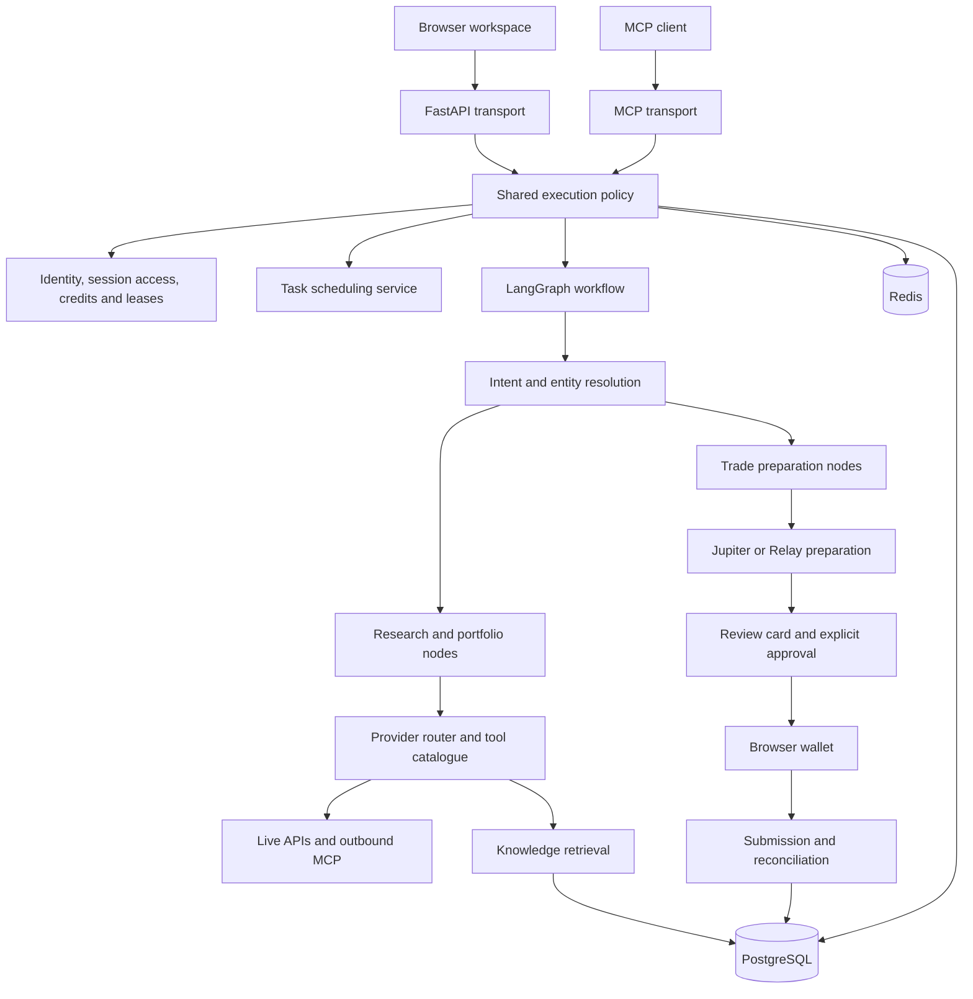
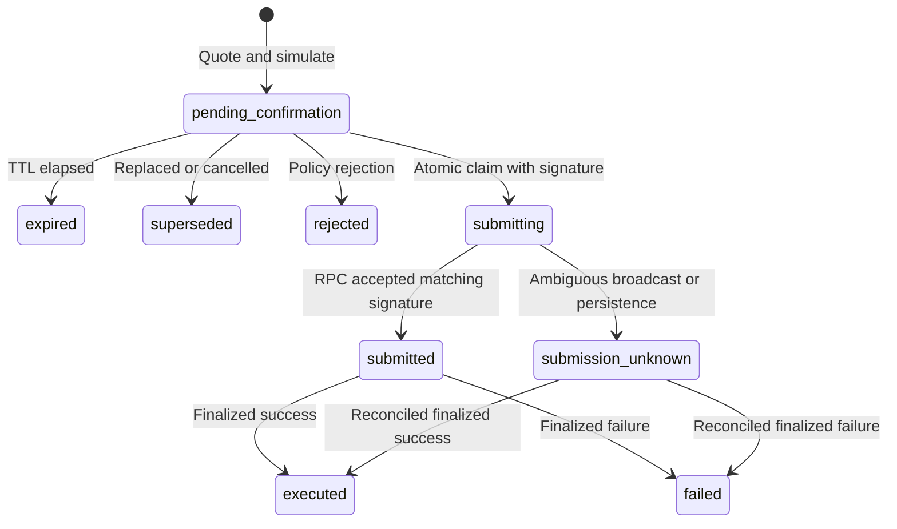

# Architecture and data

[Documentation home](README.md)

## System structure

Orbit is a modular Python application with a static browser client. It is not a fleet of independent agent microservices. FastAPI exposes HTTP, serves the UI, mounts an MCP server, and starts background workers. LangGraph composes the agent workflow; DSPy programs call LiteLLM-compatible models.

### Main module boundaries

| Layer | Modules | Responsibility |
|---|---|---|
| HTTP | `main.py`, `models.py` | Request/response contracts, middleware, transport error translation, UI mounts |
| Identity | `identity.py`, `accounts.py`, `api_keys.py`, `wallet_auth.py` | Account cookies, bearer keys, team billing identity, separate wallet authentication |
| Conversation service | `execution_policy.py`, `session_access.py`, `sessions.py` | Admission, ownership, holds, turn leases, revisions, policy, agent execution, persistence |
| Scheduling service | `task_scheduling.py`, `tasks_nl.py`, `tasks.py` | Shared user-facing validation; natural-language parsing; storage, claims, evaluation, delivery |
| Agent composition | `graph.py`, `nodes/`, `agent.py` | Workflow graph, node implementations, typed state, model programs |
| Intent routing | `routing/resolver.py`, `speech.py`, `workflow.py`, `entities.py` | Deterministic controls, speech classification, context and workflow events |
| Tool routing | `provider_registry.py`, `provider_router.py`, `tool_catalog.py` | Registration, candidate filtering, scoring, quotas, caching, fallback |
| Knowledge | `knowledge/` | Registry, connectors, documents, entities, retrieval, citations |
| Execution | `plans.py`, `execution.py`, `reconciliation.py`, `relay_tracking.py`, `web/executors.ts` | Reviewed plans, signature validation, submission claims, browser adapters, status recovery |
| Metering | `credits.py`, `billing_plans.py`, `billing.py`, `x402_gate.py` | Credit ledger, entitlements, Stripe, optional per-request payments |
| Observation | `metrics.py`, `provider_analytics.py`, `tracing.py`, `tool_outcomes.py`, `feedback.py` | Counters, provider telemetry, traces, outcome learning |

## A chat turn, step by step

1. **Resolve caller.** HTTP resolves anonymous/account/API-key identity. MCP middleware supplies a user identity or a trusted service context.
2. **Check access.** An existing owned conversation is available only to its owner. An unowned session can be claimed atomically by a signed-in caller. API-key chat scope and wallet sign-in requirements are checked.
3. **Reserve credits.** Metered callers reserve a turn allowance; service identities bypass credit accounting. Failure releases the reservation.
4. **Admit work.** Apply request rate limits, acquire a process concurrency slot, then acquire the per-session Redis lease. Timeout is explicit rather than allowing concurrent mutation.
5. **Validate revision.** Compare the client's optional `context_revision` with the server snapshot. Validate any typed quick action against the exact previously persisted action. Stale or fabricated actions receive 409.
6. **Apply session policy.** Supersede an old pending plan before new inference where appropriate, update team mode, validate/seed the risk charter, and resolve the effective wallet.
7. **Handle task controls or run the graph.** Scheduling commands use the shared scheduling service. Other messages enter the bounded agent run.
8. **Build output.** Construct answer, cards, context capsules, evidence, advisory validation, risk information, and public activity. Record tool outcomes and research gaps where applicable.
9. **Commit session state.** Persist the user/assistant pair and next canonical context together through the Redis transaction path. This transaction does not span PostgreSQL credit settlement.
10. **Settle credits.** Charge according to actual turn type, release unused reservation, return balance, and refresh the account/session association.

The code retains quick-action contracts and validation, but new suggested quick-action lists are currently emitted empty because previous suggestions were too generic.

## Intent resolution versus tool selection

These solve different problems and should be configured separately.

### Intent resolution

The resolver first handles deterministic controls and active-workflow continuations. Anchored requests—such as explicit execution fields, addresses, ownership references, and recognized instruments—can use precise rules. For topical requests, a speech classifier identifies research, advice, explanation, portfolio, policy, quote, or abstention. Model uncertainty can defer to strong evidence or trigger clarification; model unavailability has an embedding fallback.

The workflow intents returned to clients are `general`, `research`, `portfolio`, `trade`, and `cross_chain_swap`. Team mode changes graph orchestration rather than adding a public `team` intent. A model-proposed quote is not execution authorization: explicit action and competing-speech checks still apply.

### Provider selection

Tools declare capabilities, chains, matchers, credentials/availability, quotas, priority, estimated cost, handler, and catalogue specification.

The catalogue adds the API's inputs, returned fields, supported question dimensions, examples, and exclusions. This distinguishes questions that share vocabulary but require different data—for example, volume rankings versus paid token promotions. `ToolSpec.fit()` influences the deterministic score.

Eligible tools are ranked using configured priority, keyword and chain fit, specification fit, reliability, latency, estimated cost, recent failures, and learned outcomes. Candidate construction can admit a closely matching description through the optional embedding fallback. Matching remains separate from permission, health, and quota checks.

The router includes exact/conservative semantic caching, concurrent request coalescing, bounded retries for transient failures, per-tool quotas, and circuit breakers. A valid response from the wrong conceptual source can still mislead; ranking metadata and answer validation reduce that risk but do not eliminate it.

### Optional model arbitration — latest addition

`routing/tool_selector.py` reads a bounded list of already eligible tools and asks a model to choose the best fit. It only reorders candidates; it cannot add an unregistered tool or grant execution authority. It defaults to disabled.

| Setting | Code default | Meaning |
|---|---|---|
| `LLM_TOOL_SELECTION_ENABLED` | `false` | Enable arbitration |
| `TOOL_SELECTOR_MODEL` | unset | Falls back to intent model, then answer model |
| `TOOL_SELECTOR_API_BASE` | unset | Optional self-hosted endpoint |
| `TOOL_SELECTOR_API_KEY` | unset | Credential for that endpoint |
| `TOOL_SELECTOR_TIMEOUT_SECONDS` | `6` | Model request timeout setting |
| `TOOL_SELECTOR_MIN_CANDIDATES` | `2` | Skip trivial choices |
| `TOOL_SELECTOR_MAX_CANDIDATES` | `6` | Bound the displayed options |
| `TOOL_SELECTOR_CACHE_ENTRIES` | `512` | Bound cached decisions |

Disabled selection, insufficient candidates, budget exhaustion, errors, invalid names, and an open circuit preserve the original order. Cached decisions depend on request text and candidate names. Three exceptions open a short circuit. A model choice can still affect answer relevance; “only a reorder” should not be marketed as a correctness guarantee.

## Model roles and budgets

`MODEL` supplies answer programs; `INTENT_MODEL` can use a separate classifier. Tool arbitration has its own model configuration. Knowledge embeddings and tool-selection embeddings are separate from both. Knowledge reranking supports heuristic, cross-encoder, or model-assisted options. Role memory records asset-scoped analytical lessons; it is not automatic online training of model weights.

Default limits include 12 external calls and $0.50 tracked data cost per graph turn, 120 seconds for chat execution, 32 concurrent chats, and 16 concurrent LLM calls. Some provider cost estimates are zero or approximate, so tracked cost is not a reconciled invoice or a comprehensive LLM spending cap. Budget and repeat-call guards reduce runaway work but cannot guarantee provider latency.

## Execution lifecycle

### Jupiter

The browser normally requests the exact prepared transaction, obtains the wallet signature, and submits it. The server checks reviewed-message equivalence, signer, signature validity, and simulation. It records the deterministic signature before broadcasting. Reconciliation reads chain evidence; it does not sign or automatically rebroadcast.

`POST /trade-plans/{plan_id}/confirm` is a distinct **server-signing path**. It requires `LIVE_TRADING=true`, `SOLANA_PRIVATE_KEY`, a signer matching the plan wallet, exact confirmation text, valid plan state, and simulation. Browser prepare/submit also require `LIVE_TRADING`. Keeping the private key unset removes that server-signing capability without replacing the browser flow.

### Relay and LI.FI

Relay execution runs through its browser SDK and wallet adapter. A request ID and unique conversation/revision association are persisted before approval. Reload recovery checks the previous request rather than automatically producing another execution. The backend polls Relay independently; refunds and pending deposits are not successful swaps.

LI.FI supplies backup quote/status functionality. It is not an enabled interchangeable browser-signing adapter. Jupiter backend policy and Relay browser policy should be reviewed separately; do not infer uniform server enforcement from a common UI.

## Storage and retention

| Store | Data | Operational consequence |
|---|---|---|
| PostgreSQL | Users, wallet links, ownership mappings, team membership, credit ledger, API-key hashes, billing events, tasks/inbox, trade plans, Relay records, outcomes/feedback, Knowledge Base | Backups required; schema initialized with code-managed DDL |
| Redis | Chat messages/context, turn locks, prepared transactions, login/session state and other ephemeral state | Chat history/context have two-hour TTL; eviction can remove retained state before a user expects |
| Browser local storage | Recent-chat registry, titles, pins, projects/archive, appearance and local preferences | Not organization-wide or reliably cross-device synchronized |
| Local files | Provider overrides and role memory when configured | Persist and distribute deliberately in replicated deployments |
| Optional ClickHouse/Langfuse | Provider/budget analytics and traces | Separate systems with their own availability and data-retention policies |

Default history bounds are 200 display messages and an LLM context of at most eight messages / 6,000 characters. PostgreSQL `user_chat_sessions` stores ownership and timestamps, not transcript content. Account sessions default to 30 days; wallet-auth challenges to five minutes and wallet-auth sessions to seven days.

Memory fallback supports development. With fallback enabled, different processes may have different state and a restart loses memory-only data. Production configuration disables it. Redis persistence alone does not remove application TTLs. The bundled Redis `allkeys-lru` policy makes memory-pressure eviction relevant to state and locks.

## Knowledge Base pipeline

Registry bootstrap creates canonical protocols/entities. Connectors ingest protocol docs, GitHub READMEs, Snapshot governance, Discourse forums, DefiLlama detail/incidents/funding, CoinGecko metadata, global incident records, and stablecoin information.

Documents are normalized, content-hashed, versioned, chunked by structure, embedded, and linked to entities and relationships. Unchanged document hashes skip re-embedding. Structured-source relationships carry provenance; prose-derived relationships have lower-confidence semantics. Derived competitor edges are inferred from categories/chains, not proof that two businesses compete commercially.

Retrieval combines entity resolution, semantic search, lexical full-text search, graph expansion, reciprocal-rank fusion, and reranking. It returns hits and numbered citations. Knowledge covers mechanisms, governance, incidents, investors, and historical context; live prices and other current metrics remain live-tool responsibilities.

PostgreSQL uses native `vector(N)` when pgvector is available, otherwise an array-backed fallback with Python scoring. The default Compose PostgreSQL image does not provision pgvector. Default embeddings use OpenAI at dimension 1024; hashing supports offline development with different retrieval quality. Changing embedding dimensions or models requires a deliberate reindex/migration plan.

## Background work and delivery guarantees

API lifespan starts MCP discovery, Jupiter and Relay reconciliation, tool-outcome refresh, task processing, Knowledge Base resolver refresh, and an ingestion task that exits when disabled. Therefore “ingestion never runs inside the API” is inaccurate; separate ingestion is the recommended bulk operating mode.

Tasks use atomic occurrence claims and 15-minute leases. Recovery reuses the claimed occurrence key, making brief charges idempotent. A previously paid occurrence can be delivered after recovery even if the balance is now zero. This does **not** establish exactly-once inbox/email delivery: a crash around an external send can still require delivery reconciliation.

Workers are not a separate durable workflow platform. Multiple replicas add duplicate read polling and retain some process-local policy/caches. Start with one worker per container and assess each shared-state assumption before scaling.

Source: [graph](../../app/graph.py), [execution policy](../../app/execution_policy.py), [provider router](../../app/provider_router.py), [tool selector](../../app/routing/tool_selector.py), [execution](../../app/execution.py), [schema](../../app/db.py), [knowledge](../../app/knowledge/), [tasks](../../app/tasks.py).
